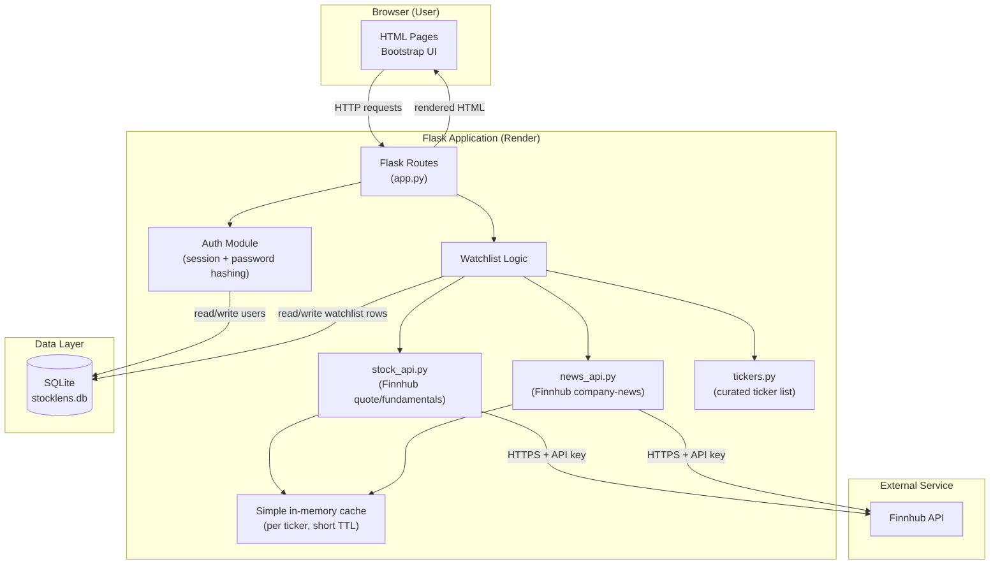
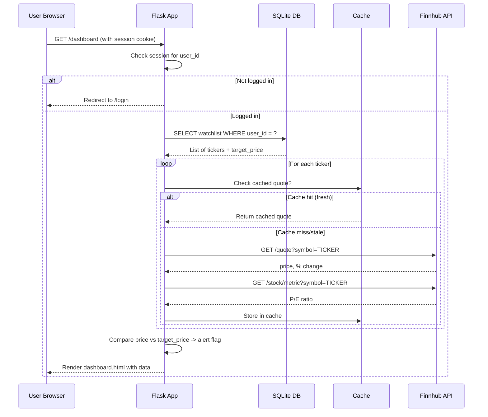
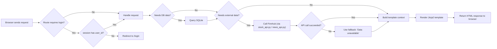

# StockLens — System Architecture

**Status:** Finalized Day 2. Source of truth for implementation (Days 3–9).
**Related docs:** PRD, Implementation Blueprint, SCHEMA.md, API.md, UI-WIREFRAMES.md, PROJECT-STRUCTURE.md

---

## 1. Finalized Tech Stack

| Layer | Choice |
|---|---|
| Frontend | HTML + Jinja2 templates + Bootstrap 5 (CDN) |
| Backend | Python + Flask |
| Database | SQLite (file-based, `stocklens.db`) |
| Authentication | Flask sessions + Werkzeug password hashing |
| AI Model/API | None required for v1.0 |
| Stock + News Data | **Finnhub API** (single provider — `/quote`, `/stock/metric`, `/company-news` endpoints) |
| Hosting | Render (free tier, GitHub-connected auto-deploy) |
| Version Control | Git + GitHub |

**Why one data provider (Finnhub) instead of two:** Originally the blueprint assumed a separate stock API and news API. Finnhub offers both stock quotes/fundamentals and company news under one free API key (60 calls/minute, no credit card). This was approved on Day 2 as a scope-safe simplification — it reduces setup steps and failure points without changing any PRD feature.

---

## 2. Component Diagram

---

## 3. Data Flow — Dashboard Page Load (Core Flow)

---

## 4. Request Lifecycle (General Pattern)

---

## 5. AI Interaction

**Not applicable for v1.0.** StockLens does not call any AI/LLM model at runtime — it is a data dashboard built on deterministic API calls and SQL queries. This keeps the app free of AI API costs and complexity, consistent with the approved PRD scope. (Noted in PRD Future Scope: AI-based news sentiment could be a future addition, not v1.0.)

---

## 6. External Services

| Service | Purpose | Auth Method | Failure Handling |
|---|---|---|---|
| Finnhub API | Stock quotes, fundamentals (P/E), company news | API key in query string / header | Wrapped in try/except; on failure, show "Data unavailable" for that stock instead of crashing the page (per PRD NFRs) |
| Render | Hosting the deployed Flask app | GitHub repo connection | N/A (deployment-time, not runtime) |
| GitHub | Source control, triggers Render auto-deploy | Git/HTTPS or SSH | N/A |

---

## 7. Caching Strategy (Simplification for Free-Tier API Limits)

To stay within Finnhub's free-tier rate limit (60 calls/minute) and keep the dashboard fast:

- A simple in-memory dictionary cache keyed by ticker symbol, storing `{data, timestamp}`.
- On each dashboard/detail page load, if a cached entry exists and is less than ~60 seconds old, reuse it instead of calling Finnhub again.
- This cache resets when the app restarts (acceptable for v1.0 — no persistence needed for cache data).

---

## 8. Security Notes (v1.0 scope)

- Passwords hashed with Werkzeug's `generate_password_hash` — never stored or logged in plaintext.
- All SQL queries use parameterized statements (no string-concatenated SQL) to prevent SQL injection.
- API keys and Flask `secret_key` stored as environment variables, never committed to Git (`.env` is git-ignored; `.env.example` documents required variable names only).
- Session cookies used for login state; no OAuth/social login in v1.0 (per PRD).
