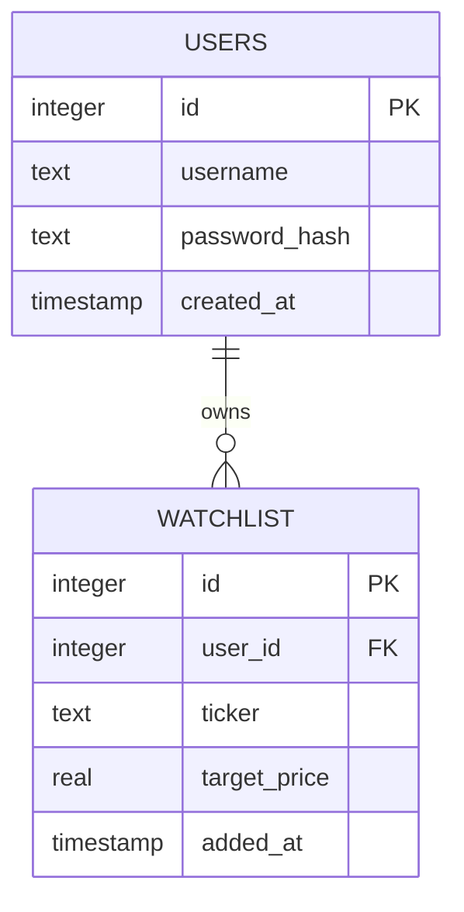

# StockLens — Database Schema

**Database:** SQLite (`stocklens.db`)
**Status:** Finalized Day 2 — implement exactly as-is on Day 3.

---

## 1. Entity-Relationship Diagram



One user has many watchlist rows. Each watchlist row belongs to exactly one user. There is no separate "stocks" table — the curated ticker list lives in code (`tickers.py`), not the database, since it's a fixed reference list, not user-generated data.

---

## 2. Table Definitions

### `users`

| Column | Type | Constraints | Notes |
|---|---|---|---|
| `id` | INTEGER | PRIMARY KEY AUTOINCREMENT | Unique user ID |
| `username` | TEXT | UNIQUE NOT NULL | Used for login (email or username, per PRD "basic auth") |
| `password_hash` | TEXT | NOT NULL | Werkzeug-hashed password, never plaintext |
| `created_at` | TIMESTAMP | DEFAULT CURRENT_TIMESTAMP | For records/debugging only |

### `watchlist`

| Column | Type | Constraints | Notes |
|---|---|---|---|
| `id` | INTEGER | PRIMARY KEY AUTOINCREMENT | Unique row ID |
| `user_id` | INTEGER | NOT NULL, FOREIGN KEY → users(id) | Owner of this watchlist entry |
| `ticker` | TEXT | NOT NULL | Must exist in curated list from `tickers.py` (validated in application code, not DB) |
| `target_price` | REAL | NULL allowed | User's alert target; NULL means "no alert set" |
| `added_at` | TIMESTAMP | DEFAULT CURRENT_TIMESTAMP | For sort order / records |

**Constraint (enforced in application logic, not SQL):** A `(user_id, ticker)` pair should be unique — i.e., a user cannot add the same ticker twice. Enforce with a `SELECT` check before `INSERT`, or add a `UNIQUE(user_id, ticker)` table constraint (recommended — see SQL below).

---

## 3. Full `schema.sql`

```sql
CREATE TABLE IF NOT EXISTS users (
  id INTEGER PRIMARY KEY AUTOINCREMENT,
  username TEXT UNIQUE NOT NULL,
  password_hash TEXT NOT NULL,
  created_at TIMESTAMP DEFAULT CURRENT_TIMESTAMP
);

CREATE TABLE IF NOT EXISTS watchlist (
  id INTEGER PRIMARY KEY AUTOINCREMENT,
  user_id INTEGER NOT NULL,
  ticker TEXT NOT NULL,
  target_price REAL,
  added_at TIMESTAMP DEFAULT CURRENT_TIMESTAMP,
  FOREIGN KEY (user_id) REFERENCES users(id),
  UNIQUE (user_id, ticker)
);
```

This is a small addition to the Day 2 blueprint's original schema (the `UNIQUE(user_id, ticker)` constraint) — it prevents duplicate-ticker bugs at the database level instead of relying only on application logic, with no impact on scope or timeline.

---

## 4. Validation Against Every PRD User Story

| User Story | Schema Support |
|---|---|
| Sign up with username/email + password | `users.username`, `users.password_hash` |
| Log in securely | `users.username` + `password_hash` lookup |
| Add a stock to watchlist | `INSERT INTO watchlist (user_id, ticker)` |
| Remove a stock from watchlist | `DELETE FROM watchlist WHERE id = ? AND user_id = ?` (ownership check) |
| View price/%change/P/E per stock | Ticker read from `watchlist`, live data fetched from Finnhub at request time (not stored) |
| View news per stock | Ticker read from `watchlist`, news fetched from Finnhub at request time (not stored) |
| Set a target price for a stock | `UPDATE watchlist SET target_price = ? WHERE id = ? AND user_id = ?` |
| See alert badge when target is met | Computed at request time: compare live price (Finnhub) to `watchlist.target_price` |
| Compare all watchlisted stocks in one table | `SELECT * FROM watchlist WHERE user_id = ?`, joined in-app with live Finnhub data |

✅ Every PRD user story is fully supported by this two-table schema. No additional tables are required for v1.0.

**Deliberately NOT stored in the database (v1.0 scope):** live prices, % change, P/E, and news headlines. These are fetched fresh from Finnhub on each page load per the PRD ("data refreshes on page load only") — storing them would require a sync/refresh job, which is explicitly out of scope for v1.0.

---

## 5. Notes for Day 3 Implementation

- Initialize the DB by running `schema.sql` once (e.g., a small `init_db()` function in `app.py` that runs on first launch if `stocklens.db` doesn't exist yet).
- Use Python's built-in `sqlite3` module with parameterized queries (`?` placeholders) — never string-format ticker/username values directly into SQL.
- Remember: Render's free tier has an ephemeral filesystem, so `stocklens.db` may reset on redeploy. This is a known, accepted limitation for the capstone demo (documented in the Implementation Blueprint, Day 9 debugging tips).
