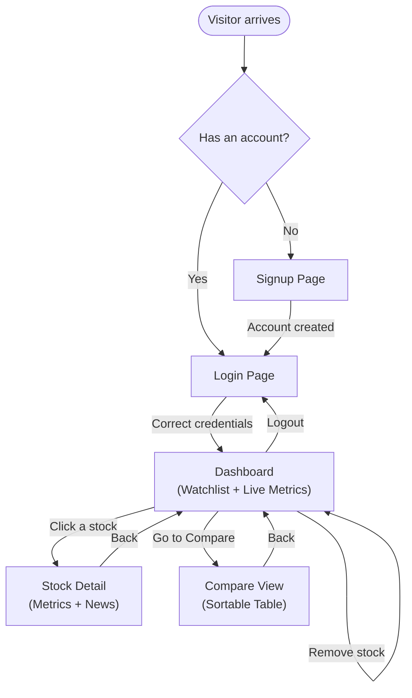
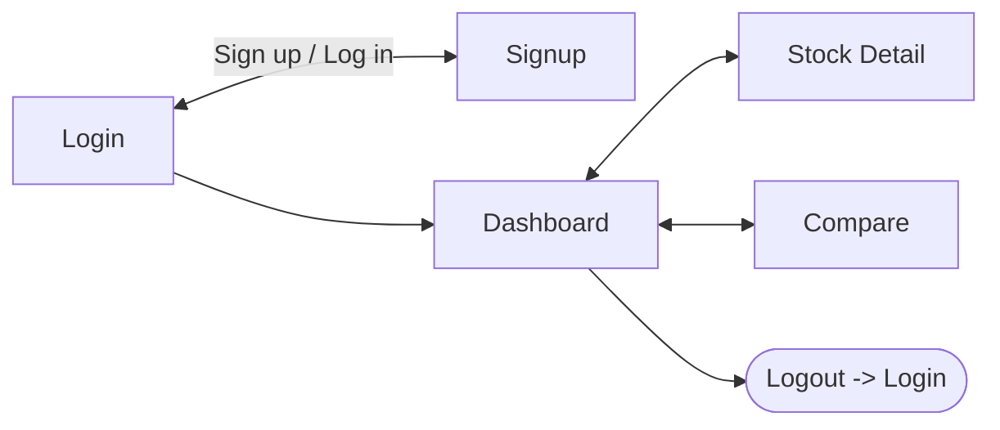

# StockLens — UI & User Flow

**Status:** Finalized Day 2. Every screen below exists to serve exactly one PRD user story — no extra screens.

---

## 1. User Flow Diagram



---

## 2. Screen Flow (Navigation Map)



**Navbar (present on all logged-in pages):** StockLens logo/name · Dashboard · Compare · Logout
**No navbar on:** Login, Signup (kept minimal, focused on the single task of getting in)

---

## 3. Screens (Low-Fidelity Wireframes)

### 3.1 Signup Page (`/signup`)

```
+-----------------------------------------+
|              StockLens                  |
|                                          |
|          Create your account            |
|                                          |
|   Username: [______________________]    |
|   Password: [______________________]    |
|   Confirm:  [______________________]    |
|                                          |
|            [  Sign Up  ]                 |
|                                          |
|   Already have an account? Log in       |
+-----------------------------------------+
```
**Purpose:** Fulfills "sign up with username/email + password" user story. Nothing else on this screen — no distractions.

### 3.2 Login Page (`/login`)

```
+-----------------------------------------+
|              StockLens                  |
|                                          |
|              Log in                     |
|                                          |
|   Username: [______________________]    |
|   Password: [______________________]    |
|                                          |
|            [  Log In  ]                  |
|                                          |
|   New here? Create an account           |
+-----------------------------------------+
```
**Purpose:** Fulfills "log in securely" user story.

### 3.3 Dashboard (`/dashboard`) — the core screen

```
+--------------------------------------------------------------+
| StockLens     Dashboard | Compare              [Logout]      |
+--------------------------------------------------------------+
| Search stocks: [_____________________]  [Add]                |
+--------------------------------------------------------------+
|  Your Watchlist                                               |
|  +----------------------+  +----------------------+           |
|  | AAPL  Apple Inc.     |  | TSLA  Tesla Inc.  🔔 |           |
|  | $189.32   +1.2%      |  | $242.10   -0.8%      |           |
|  | P/E: 29.4            |  | P/E: 61.2             |           |
|  | Target: [150.00][Save]|  | Target: [250.00][Save]|          |
|  | [View]     [Remove]  |  | [View]      [Remove] |           |
|  +----------------------+  +----------------------+           |
|  ... (more stock cards, wraps into a grid) ...                |
|                                                                |
|  (Empty state if no stocks yet:)                              |
|  "Your watchlist is empty — search above to add your first    |
|   stock."                                                     |
+--------------------------------------------------------------+
```
**Purpose:** Fulfills add/remove, view metrics, set target price, and see alert badge — the heart of the product. The 🔔 badge only appears when the alert condition is met.

### 3.4 Stock Detail (`/stock/<ticker>`)

```
+--------------------------------------------------------------+
| StockLens     Dashboard | Compare              [Logout]      |
+--------------------------------------------------------------+
| < Back to Dashboard                                           |
|                                                                |
|  AAPL — Apple Inc.                                             |
|  $189.32   +1.2%        P/E: 29.4                              |
|                                                                |
|  Recent News                                                   |
|  --------------------------------------------------------     |
|  • Apple unveils new product line (Reuters) — 2 days ago       |
|  • Analysts raise price target on strong earnings (CNBC)       |
|  • Apple supplier reports strong Q2 orders (Bloomberg)         |
|  --------------------------------------------------------     |
|  (Empty state: "No recent news found for this stock.")         |
+--------------------------------------------------------------+
```
**Purpose:** Fulfills "view recent news for a stock" user story, plus a focused view of that stock's metrics.

### 3.5 Compare View (`/compare`)

```
+--------------------------------------------------------------+
| StockLens     Dashboard | Compare              [Logout]      |
+--------------------------------------------------------------+
| Compare Your Watchlist                                        |
|                                                                |
|  Ticker ^v | Price ^v | % Change ^v | P/E ^v | Target | Alert  |
|  ---------------------------------------------------------    |
|  AAPL      | 189.32   | +1.2%       | 29.4   | 150.00 |        |
|  TSLA      | 242.10   | -0.8%       | 61.2   | 250.00 |  🔔    |
|  ...                                                           |
|                                                                |
|  (Empty state: "Add stocks to your watchlist to compare       |
|   them here.")                                                 |
+--------------------------------------------------------------+
```
**Purpose:** Fulfills "compare all watchlisted stocks in one table" user story. Column headers (^v) are clickable to sort.

---

## 4. Navigation Rules

- Unauthenticated users can only reach `/login` and `/signup`. Any other URL redirects to `/login`.
- Authenticated users see the navbar (Dashboard / Compare / Logout) on every page except Login/Signup.
- The Dashboard is the default landing page after login — it's the "home" of the app.
- Every screen has a clear way back to the Dashboard (navbar link or "Back" link).

## 5. Responsive Behavior (Mobile)

- Stock cards on Dashboard stack into a single column below ~576px width (Bootstrap's `col-12` on small screens, `col-md-6`/`col-lg-4` on larger screens).
- Compare table becomes horizontally scrollable within its container on narrow screens (`table-responsive` Bootstrap class) rather than squeezing columns unreadably.
- Search box and navbar collapse using Bootstrap's standard responsive navbar component.
